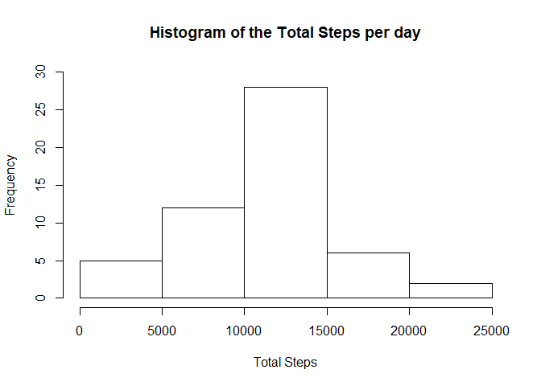
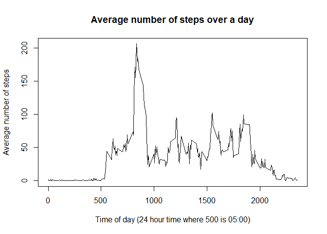
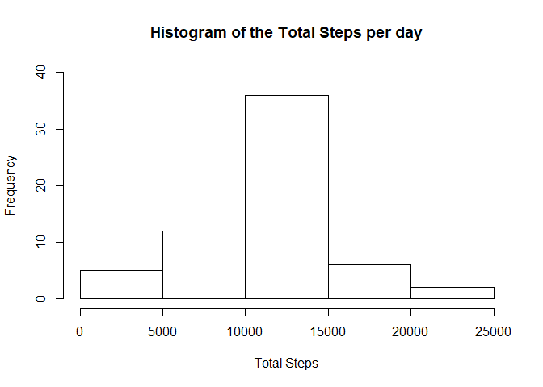
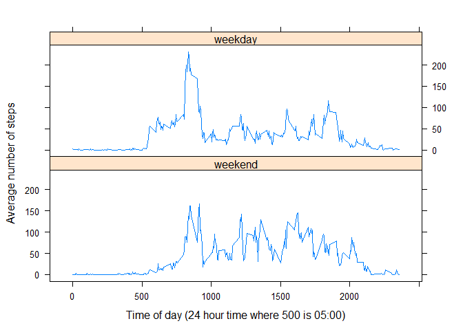

## Introduction

This report will address the following topics:  
- Loading and preprocessing the data  
- What is the mean total numbers of steps taken per day?  
- What is the average daily activity pattern?  
- Imputing missing values  
- Are there differences in activity patterns between weekdays and weekends?  


## Loading and preprocessing the data

First, after saving the data in your working directory, you need to read the data and ensure the date is recognised as "Date" format rather than character.  


```r
## Read the data and store as a variable called data.
data <- read.csv("activity.csv")

## Convert date columns into date format rather than characters.
data$date <- as.Date(data$date)
```

## What is mean total number of steps taken per day?

I need to calculate the total number of steps per day and put into another dataset.  


```r
## Create a dataset summing all the Total Steps per day and rename heading
    TotalSteps <- aggregate(data$steps, by = list(Day = data$date), FUN = sum)
    
    library(dplyr)
```

```
## Warning: package 'dplyr' was built under R version 3.6.3
```

```
## 
## Attaching package: 'dplyr'
```

```
## The following objects are masked from 'package:stats':
## 
##     filter, lag
```

```
## The following objects are masked from 'package:base':
## 
##     intersect, setdiff, setequal, union
```

```r
    TotalSteps <- rename(TotalSteps, TotalSteps = x)
```

A histogram then needs to be plotted to show the frequency of the total steps per day.  


```r
## Plot the histogram showing the total number of steps.
hist(TotalSteps$TotalSteps, main = "Histogram of the Total Steps per day", xlab = "Total Steps", ylim = c(0,30))
```

<!-- -->
  
As you can, see the most frequent number of steps per day ranges between 10,000 steps and 15,000 steps.  
  
Next the mean and median total steps per day needs to be calculated.  


```r
## Calculate the mean total steps per day
mean(TotalSteps$TotalSteps, na.rm = TRUE)
```

```
## [1] 10766.19
```

```r
## Calculate the median total steps per day
median(TotalSteps$TotalSteps, na.rm = TRUE)
```

```
## [1] 10765
```
  As you can see the mean and median total steps per day is 10,766.19 steps and 10,765 steps respectively.  Note that NA errors have been ignored.


## What is the average daily activity pattern?
We have been asked to look at the average daily activity pattern. The first step is to prepare a dataset showing the average number of steps per day for each time interval.  


```r
## Create a dataset showing the average total steps per day split into time intervals
AverageSteps <- aggregate(data$steps, by = list(Interval = data$interval), FUN = mean, na.rm = TRUE)

## rename the headings
AverageSteps <- rename(AverageSteps, AverageSteps = x)
```

  Then a line graph is plotted to show the change in average steps over the time of day.  
  

```r
##Plot the line graph
with(AverageSteps, plot(Interval, AverageSteps, type = "l", xlab = "Time of day (24 hour time where 500 is 05:00)", ylab = "Average number of steps", main = "Average number of steps over a day"))
```

<!-- -->

  We must find out which time interval has the max number of average steps in a day.  
  

```r
## Calculate the max number of average steps and output the time interval associated with it.
AverageSteps[which.max(AverageSteps$AverageSteps),]
```

```
##     Interval AverageSteps
## 104      835     206.1698
```
  This is showing the time of day with the highest number of steps is 08:35, a busy time of the day with commuters going to work and children going to school.

## Imputing missing values

There are missing values in the dataset denoted with _NA_. The first step is to figure out how many _NA_ values there are in the dataset.


```r
## Identify and state how many missing data items there are in the set.
NAerrors <- is.na(data$steps)
table(NAerrors)
```

```
## NAerrors
## FALSE  TRUE 
## 15264  2304
```
  As you can see there are 2,304 missing data items.  
  
I will replace the _NA_ vaues with the mean of the associated 5 minute interval.  


```r
## Create a second dataset called data2, then replace the missing NA values with the means of each 5 minute interval
library(expss)
```

```
## Warning: package 'expss' was built under R version 3.6.3
```

```
## 
## Attaching package: 'expss'
```

```
## The following objects are masked from 'package:dplyr':
## 
##     between, compute, contains, first, last, na_if, recode, vars
```

```r
data2 <- data
if_na(data2$steps) = window_fun(data2$steps, data2$interval, mean_col)
```

  To test how much of an impact this had had on the data, I create another histogram and calculate the mean and median.


```r
## Create another dataset summing all the Total Steps per day and rename heading from data2
    TotalSteps2 <- aggregate(data2$steps, by = list(Day = data2$date), FUN = sum)
    
    library(dplyr)
    TotalSteps2 <- rename(TotalSteps2, TotalSteps = x)


## Prepare another histogram and the mean and median
hist(TotalSteps2$TotalSteps, main = "Histogram of the Total Steps per day", xlab = "Total Steps", ylim = c(0,40))
```

<!-- -->

```r
## Calculate the mean total steps per day
mean(TotalSteps2$TotalSteps)
```

```
## [1] 10766.19
```

```r
## Calculate the median total steps per day
median(TotalSteps2$TotalSteps)
```

```
## [1] 10766.19
```
  The mean is unchanged but the median is now equal to the mean. This seems reasonable given more _NA_ values have been replaced with the mean of each 5 minute interval. The median has only increased by a couple of steps.  Replacing missing values implies the subjects have been walking more frequently than they may have been.

## Are there differences in activity patterns between weekdays and weekends?

First I need to create a column in the dataset stating if the date is a weekday or weekend.


```r
## Create a column with all the days in it.
  data2$Day <- weekdays(data2$date)

##Create a vector with all the week days in it
WeekDays1 <- c("Monday","Tuesday","Wednesday","Thursday","Friday")

## Create a column with the weekend/weekday labels in it
data2$DayType <- factor((weekdays(data2$date) %in% WeekDays1),levels=c(FALSE, TRUE), labels=c('weekend', 'weekday'))
```
  Finally I need to see how the average steps over 5 minute intervals differs between weekdays and weekends.


```r
## Create a dataset aggregating the average steps over weekdays and weekends
AverageSteps2 <- aggregate(data2$steps, by = list(Interval = data2$interval, DayType = data2$DayType), FUN = mean)

## rename the headings
AverageSteps2 <- rename(AverageSteps2, AverageSteps = x)

## Create a line graph showing this information
library(lattice)
xyplot(AverageSteps ~ Interval | DayType, data = AverageSteps2, layout = c(1,2), type = "l", ylab = "Average number of steps", xlab = "Time of day (24 hour time where 500 is 05:00)")
```

<!-- -->
